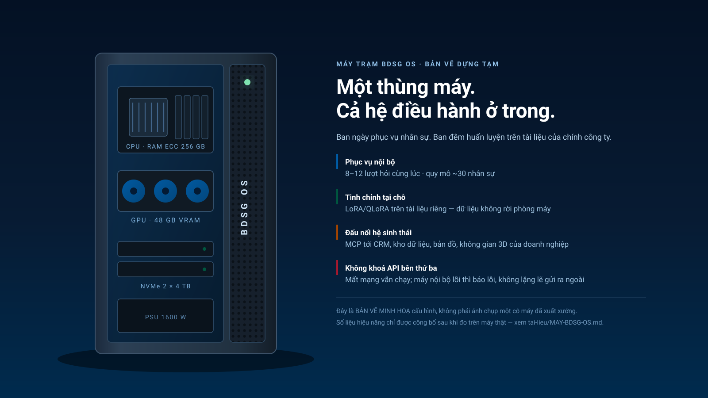

# Open BDSG OS

[](LICENSE-CODE)
[](LICENSE-DATA)


**Hệ điều hành mã nguồn mở cho doanh nghiệp: một mô hình ngôn ngữ chạy trên máy của chính
công ty, một phần nhân giữ danh tính — quyền — hạn mức — nhật ký, và một giao thức duy
nhất (MCP) để chạm tới mọi nền tảng nghiệp vụ. Tiếng Việt là ngôn ngữ chính, tiếng Anh là
ngôn ngữ phụ.**

## Luận đề

Phần lớn "AI cho doanh nghiệp" hôm nay là một ô chat đặt cạnh phần mềm. Nó không biết ai
đang hỏi, không biết người ấy được phép đọc gì, không ghi lại việc nó đã làm, và mỗi câu
hỏi là một lần dữ liệu rời khỏi toà nhà.

Một **hệ điều hành** giải bài toán khác. Hệ điều hành máy tính không phải là phần mềm chạy
nhanh hơn — nó là lớp đứng giữa chương trình và phần cứng để quản **tiến trình, quyền, bộ
nhớ và thiết bị**. Open BDSG OS đặt đúng những lớp ấy giữa **tác nhân AI** và **nghiệp vụ
doanh nghiệp**:

| Khái niệm hệ điều hành | Tương ứng trong Open BDSG OS |
|---|---|
| Lời gọi hệ thống (syscall) | Một **công cụ** mà mô hình được phép gọi |
| Trình điều khiển thiết bị | Một **máy chủ MCP** nối vào một nền tảng |
| Thiết bị | CRM, kho dữ liệu, bản đồ, không gian 3D, cổng thanh toán… |
| Nhân (kernel) | `nhan/` — danh tính, quyền, hạn mức, nhật ký, định tuyến |
| Tiến trình | Một phiên tác nhân, có chủ và có trần chi phí |
| Bộ nhớ ảo | Kho tri thức có phân quyền theo từng người, từng tài liệu |

Hệ quả kiểm chứng được, không phải khẩu hiệu: **mọi lời gọi công cụ đều đi qua nhân**, nên
nó luôn có một chủ thể, một phép thử quyền và một dòng nhật ký. Không có đường vòng, vì
đường vòng là thứ cổng kiểm tra trong `cong/` được viết ra để chặn.

## Quy mô huấn luyện hướng tới: 30 tỷ tham số

Đây là **đích của lộ trình**, không phải hiện trạng. Nói rõ để không ai đọc nhầm:

| | Số thật, đo ngày 26/09/2026 |
|---|---|
| Trọng số BDSG tự huấn luyện, hiện có | **26.878.464 tham số** (26,9 triệu) |
| Ngữ liệu BDSG đã gom | **14,72 MB · 4,37 triệu token** |
| Đích lộ trình | **~30 tỷ tham số** |
| Khoảng cách | Mô hình hiện tại bằng **0,09 %** đích |

Vì sao là 30 tỷ chứ không phải một con số to hơn cho oai. Ở mức 30 tỷ tham số lượng tử hoá
4-bit, trọng số vừa một card đồ hoạ 24–48 GB — tức **vừa một thùng máy đặt trong phòng máy
của doanh nghiệp**, không cần một cụm máy chủ. Đó là ràng buộc quyết định kiến trúc: mô
hình phải đủ lớn để làm được việc, và đủ nhỏ để **không bao giờ cần rời khỏi toà nhà**.

Ràng buộc đã biết, chưa đo, phải đo trước khi hứa: **gọi công cụ nhạy với lượng tử hoá gấp
khoảng 70 lần so với sinh văn bản thường** (họ Gemma-3 12B rơi 91,3 % → 69,0 % BFCL khi ép
xuống Q4_K_M; họ Qwen-3 8B thì gần như không rơi). Một hệ điều hành sống bằng gọi công cụ,
nên đây là phép đo bắt buộc chứ không phải chi tiết kỹ thuật phụ.

Theo quy luật Chinchilla (~20 token mỗi tham số), 30 tỷ tham số cần khoảng **600 tỷ
token**. Ngữ liệu BDSG hiện có 4,37 triệu. Con đường không phải là "gom thêm dữ liệu BDSG
cho đủ" — điều đó bất khả — mà là **tinh chỉnh trên nền một mô hình nền đã huấn luyện
trước**, dùng ngữ liệu BDSG cho thứ mô hình nền không có: tri thức tư vấn, triển khai, vận
hành, và dữ liệu hành chính — doanh nghiệp Việt Nam.

## Hệ sinh thái: những "thiết bị" mà hệ điều hành này lái

Doanh nghiệp không cần một trợ lý biết nói. Họ cần một trợ lý **chạm được vào việc**. Mỗi
nền tảng dưới đây nối vào nhân qua một trình điều khiển MCP, và mỗi lời gọi đều mang theo
danh tính người hỏi:

| Nền tảng | Tác nhân làm được gì qua MCP |
|---|---|
| CRM | Đọc/ghi khách hàng, việc cần làm, hợp đồng — trong phạm vi quyền của người hỏi |
| Kho dữ liệu | Truy vấn dữ liệu doanh nghiệp, hành chính, dự án |
| Bản đồ & dữ liệu hành chính | 34 tỉnh, 3.321 phường/xã theo NQ 202/2025/QH15 |
| Danh bạ doanh nghiệp | Hơn một triệu bản ghi, gán về đơn vị hành chính |
| Không gian 3D (Twin) | Dựng, sửa, mở không gian triển lãm của doanh nghiệp |
| Học liệu & tài liệu nội bộ | Kho tri thức có phân quyền theo người và theo tài liệu |

Gọi đây là **nền kinh tế số** không phải để nghe cho kêu: khi nhiều doanh nghiệp cùng chạy
một hệ điều hành mở, mỗi nơi vẫn giữ dữ liệu của mình, nhưng **giao thức thì chung** — nên
một tác nhân bên A gọi được dịch vụ bên B mà không bên nào phải giao dữ liệu gốc cho bên
kia. Đó là điều kiện kỹ thuật của một thị trường, không phải là một lời hứa thương mại.

## Cấp phép trọng số đi kèm máy

Mã nguồn trong kho này là **Apache-2.0** — tải về, sửa, dùng thương mại, không phải hỏi ai.

**Trọng số thì tách riêng.** Trọng số BDSG tự huấn luyện được cấp phép **đi kèm máy trạm
BDSG OS**: doanh nghiệp mua máy thì nhận trọng số cùng máy, cài sẵn, chạy được ngay, và
được tinh chỉnh tiếp trên tài liệu của chính mình. Lý do là vận hành chứ không phải giữ
của: một bản trọng số phát tán rời khỏi phần cứng đã kiểm chứng sẽ chạy sai trên cấu hình
bất kỳ, và mọi báo lỗi sau đó đều không truy được nguồn.

Ba điều phải nói thẳng vì chúng dễ bị đọc nhầm:

1. **Chưa có bản trọng số phát hành nào.** Bản BDSG tự huấn luyện hiện tại là bản nghiên
   cứu và chưa dùng được cho việc gì.
2. **Trọng số Gemma 4 31B là của Google DeepMind**, Apache-2.0, không phải của BDSG. Kho
   này chỉ có phần *backend phục vụ* nó. Xem [bảng phân biệt](#hai-thu-khac-nhau-trong-kho-nay).
3. **Giấy phép đi-kèm-máy chỉ áp cho trọng số BDSG tự huấn luyện**, không áp cho mã nguồn
   và không áp cho trọng số của bên khác.

## Máy trạm BDSG OS



*Bản vẽ dựng tạm, không phải ảnh chụp một cỗ máy đã xuất xưởng.*

Một thùng máy: ban ngày phục vụ nhân sự, ban đêm tinh chỉnh trên tài liệu của chính công
ty. Cấu hình, lập luận chọn từng linh kiện, và **những gì chưa đo** nằm ở
[`tai-lieu/MAY-BDSG-OS.md`](tai-lieu/MAY-BDSG-OS.md).

Các máy ấy còn có thể **cùng góp vào mô hình chung**: mỗi nơi tinh chỉnh trên dữ liệu
của mình rồi chỉ gửi về bộ điều hợp, không gửi dữ liệu. Đó là ĐỀ XUẤT kiến trúc, chưa
có mã — kèm ba giới hạn phải đọc trước khi hứa với ai:
[`tai-lieu/CUNG-HUAN-LUYEN.md`](tai-lieu/CUNG-HUAN-LUYEN.md).

---

> **Số đo trong README này là số đo trên CƠ SỞ DỮ LIỆU NGUỒN và trên hệ đang chạy, không
> phải số tệp bạn nhận được khi clone.** Việc kết xuất ngữ liệu ra tệp và nạp bộ câu hỏi
> vào kho thuộc các mốc phía sau, do các nhóm khác của dự án làm trong `bo-du-lieu/`,
> `danh-gia/` và `huan-luyen/`. Muốn biết bản clone của bạn thật sự có gì thì **liệt kê
> các thư mục ấy**, đừng suy từ tài liệu gốc kho: trạng thái thư mục đổi theo giờ, còn
> tài liệu thì không.

---

## Mục lục

- [Luận đề](#luan-de)
- [Quy mô huấn luyện hướng tới: 30 tỷ tham số](#quy-mo-huan-luyen-huong-toi-30-ty-tham-so)
- [Hệ sinh thái](#he-sinh-thai-nhung-thiet-bi-ma-he-dieu-hanh-nay-lai)
- [Cấp phép trọng số đi kèm máy](#cap-phep-trong-so-di-kem-may)
- [Máy trạm BDSG OS](#may-tram-bdsg-os)
- [Cùng huấn luyện (đề xuất)](tai-lieu/CUNG-HUAN-LUYEN.md)
- [Hai thứ khác nhau trong kho này](#hai-thu-khac-nhau-trong-kho-nay)
- [Bảng trạng thái thẳng thắn](#bang-trang-thai-thang-than)
- [Backend Gemma 4 31B của Google](#backend-gemma-4-31b-cua-google)
- [Vì sao phát hành dữ liệu trước, trọng số sau](#vi-sao-phat-hanh-du-lieu-truoc-trong-so-sau)
- [Thứ tự ngôn ngữ: Việt chính, Anh phụ](#thu-tu-ngon-ngu-viet-chinh-anh-phu)
- [Bộ dữ liệu: số đo ngày 25/09/2026](#bo-du-lieu-so-do-ngay-25092026)
- [Những gì CỐ Ý không có trong bộ này và vì sao](#nhung-gi-co-y-khong-co-trong-bo-nay-va-vi-sao)
- [Đường cơ sở đánh giá M3](#duong-co-so-danh-gia-m3)
- [Lộ trình M1 → M7](#lo-trinh-m1--m7)
- [Kiến trúc](#kien-truc-du-kien)
- [Cách chạy cục bộ](#cach-chay-cuc-bo)
- [Cách gọi API llm.bdsg.vn](#cach-goi-api-llmbdsgvn)
- [Cấu trúc kho](#cau-truc-kho)
- [Giấy phép](#giay-phep)
- [Trích dẫn](#trich-dan)

---

<a id="hai-thu-khac-nhau-trong-kho-nay"></a>

## Hai thứ khác nhau trong kho này

Kho này chứa **hai thứ tách rời**. Trộn chúng vào một mục là cách nhanh nhất để nói sai về
cả hai, nên chúng được tách ngay từ đây:

| | **(a) Mô hình nhỏ BDSG tự huấn luyện** | **(b) Backend phục vụ Gemma 4 31B** |
|---|---|---|
| Trọng số của ai | **BDSG** — huấn luyện từ đầu | **Google DeepMind** |
| Cỡ | 26.878.464 tham số (đo 26/09/2026) | 31.273.088.876 tham số |
| Từ vựng | 6.400 token, BDSG tự luyện | 262.144 token, của Google |
| Dùng được chưa | **chưa** — nhánh nghiên cứu, xem lý do bên dưới | chưa chạy thật lần nào (chưa có GPU) |
| `bdsg_la_trong_so_bdsg` | `true` cho đúng bản trọng số ấy | **`false`** — BDSG chỉ phục vụ |
| Thư mục | `mo-hinh/` · `huan-luyen/` | `trien-khai/` · `tai-lieu/GEMMA4-31B.md` |
| Giấy phép | Apache-2.0 (mã), CC BY 4.0 (dữ liệu) | Apache-2.0 (trọng số của Google) |

**Hai nhánh này không được trộn về mặt kỹ thuật**, và hai điều cấm dưới đây đều hỏng một
cách lặng lẽ — không có thông báo lỗi nào:

- **Không nạp trọng số Gemma 4 vào kiến trúc trong `mo-hinh/`.** Hai kiến trúc khác nhau ở
  gần như mọi chiều; nạp được một phần rồi sinh chữ vô nghĩa còn tệ hơn báo lỗi.
- **Không thay tokenizer/chat template gốc của Gemma bằng bộ từ vựng 6.400 của BDSG.** Đổi
  tokenizer là đổi ý nghĩa của từng mã token mà mô hình đã học.

---

<a id="bang-trang-thai-thang-than"></a>

## Bảng trạng thái thẳng thắn

Cột "Đo ngày" ghi ngày con số trong dòng đó được đo thật. Dòng nào không có số đo thì ghi
thẳng là **chưa đo**, không ước lượng.

| Hạng mục | Trạng thái | Số đo | Đo ngày |
|---|---|---|---|
| Ngữ liệu phát hành được | **ĐÃ CÓ** | 11.733 đoạn · 7.509.969 ký tự · 7,16 MB | 25/09/2026 |
| Lớp doanh nghiệp có cấu trúc | **ĐÃ CÓ** | 5.424 doanh nghiệp đủ ba điều kiện | 25/09/2026 |
| Quét dữ liệu cá nhân trên ngữ liệu | **ĐÃ CHẠY** | 0 email · 0 số điện thoại · 0 URL nội bộ | 25/09/2026 |
| Bộ đánh giá đóng băng | **ĐÃ CÓ** | 227 câu, 4 nhóm (111 + 31 + 60 + 25) | 22/09/2026 |
| Đường cơ sở đánh giá | **ĐÃ CÓ** | xem [bảng M3](#duong-co-so-danh-gia-m3) | 22/09/2026 |
| API tương thích OpenAI tại `llm.bdsg.vn` | **ĐÃ SỐNG** | `/` → 200 · `/v1/models` → 200 · `/api/suc-khoe` → 200 | 25/09/2026 |
| **Trọng số do BDSG huấn luyện** — bản **nghiên cứu** đầu tiên | **ĐÃ CÓ** | 26.878.464 tham số · 107,5 MB · perplexity kiểm 102,5 · **chưa dùng được cho việc gì** | 26/09/2026 |
| Trọng số do BDSG huấn luyện — bản **dùng được** | **CHƯA CÓ** | quá khớp 5,2 lần; ngữ liệu thiếu ~348 lần so với mức tính-toán-tối-ưu | 26/09/2026 |
| Mô hình BDSG phục vụ tại `llm.bdsg.vn` | **CHƯA PHẢI của BDSG** | API tự khai `bdsg_la_trong_so_bdsg = false` cho **mọi** mã mô hình | 25/09/2026 |
| **Backend phục vụ Gemma 4 31B của Google** — kịch bản + tài liệu | **ĐÃ CÓ** | `trien-khai/chay-vllm.sh` · tự kiểm ĐẠT 45/45 · lần chạy kiểm mặc định trên máy không GPU chặn 4 vấn đề | 26/09/2026 |
| Backend Gemma 4 31B — **chạy thật** | **CHƯA CHẠY** | chưa cài được `vllm`, chưa nạp trọng số, chưa có GPU | chưa đo |
| Độ trễ / thông lượng của Gemma 4 31B | **CHƯA ĐO** | không có GPU để đo | chưa đo |
| Từ vựng (tokenizer) tiếng Việt — bản **thử nghiệm** | **ĐÃ ĐO** | giảm 66,1% token tiếng Việt so với một từ vựng cùng cỡ 6.400 nhưng không học tiếng Việt | 25/09/2026 |
| Từ vựng (tokenizer) — bản **phát hành** | **CHƯA CÓ** | chưa trộn tiếng Anh | chưa đo |
| Bộ dữ liệu tiền huấn luyện đóng gói `.jsonl` | **CHƯA CÓ** | — | chưa đo |
| Chi phí GPU thật đã trả | **CHƯA CÓ** | chưa thuê GPU lần nào | chưa đo |

### Phải nói rõ ba điều

1. **Kho này không chứa tệp trọng số nào.** Không có `.safetensors` trong kho và không có
   liên kết tải trọng số nào ở phần dưới — trọng số lớn không đi vào git (xem `.gitignore`).
   BDSG **đã** huấn luyện một bản trọng số nghiên cứu ngày 26/09/2026 (26.878.464 tham số,
   [chi tiết](tai-lieu/LAN-HUAN-LUYEN-DAU-TIEN.md)), nhưng nó **chưa dùng được cho việc gì**:
   perplexity phần kiểm 102,5 so với phần học 19,9, tức quá khớp 5,2 lần. Mục nào cần một
   bản trọng số **dùng được** thì trong [MODEL-CARD.md](MODEL-CARD.md) vẫn ghi "chưa huấn
   luyện — mục này trống cho tới M7".

2. **Thứ đang chạy tại `llm.bdsg.vn` là TRUY HỒI đặt trước một mô hình của bên thứ ba,
   không phải trọng số của BDSG.** Lớp truy hồi dùng `pg_trgm` + `tsvector` của PostgreSQL —
   tức là **khớp chữ, không phải khớp vector**: cổng LiteLLM của BDSG không có mô hình nhúng
   (embedding) nào, nên không có lựa chọn nào khác. Mã mô hình `/v1/models` trả về là
   `openbiz-vn-chat` và `openbiz-vn-reasoner`; cả hai đều trả
   `bdsg_la_trong_so_bdsg = false` (gọi lại và đọc tận nơi ngày 25/09/2026).

3. **Vì thế kho này KHÔNG được gọi là "mô hình ngôn ngữ của BDSG" cho tới mốc M7.** Cho tới
   lúc đó nó là một bộ dữ liệu mở, một bộ đánh giá đóng băng, một dây chuyền huấn luyện đã
   chứng minh chạy hết được, và — từ 26/09/2026 — một backend **phục vụ trọng số của
   Google**. Cái cuối cùng ấy là của Google, không phải của BDSG.

---

<a id="backend-gemma-4-31b-cua-google"></a>

## Backend Gemma 4 31B của Google

Từ 26/09/2026 kho này có thêm một đường chạy **khác hẳn** nhánh mô hình nhỏ: phục vụ
**`google/gemma-4-31B-it`** qua **vLLM**, với API tương thích OpenAI, **trên máy nội bộ**.

**Trọng số là của Google DeepMind, giấy phép Apache-2.0.** BDSG **phục vụ** chúng; BDSG
**không** huấn luyện chúng và không sở hữu chúng.

| Nguồn chính thức | |
|---|---|
| Trọng số bản chat | `https://huggingface.co/google/gemma-4-31B-it` |
| Trọng số bản nền | `https://huggingface.co/google/gemma-4-31B` |
| Mã triển khai của Google | `https://github.com/google-deepmind/gemma` |
| Bài báo | arXiv:2607.02770 |
| Giấy phép | **Apache-2.0** (khác hẳn giấy phép riêng của Gemma 1–3) |

Tài liệu đầy đủ: **[`tai-lieu/GEMMA4-31B.md`](tai-lieu/GEMMA4-31B.md)** — thông số mô
hình, bảng VRAM, cảnh báo lượng tử hoá, và mục "ai sở hữu cái gì".
Lộ trình tinh chỉnh: **[`tai-lieu/LO-TRINH-LORA.md`](tai-lieu/LO-TRINH-LORA.md)**.

### Khởi động nội bộ

```bash
cp trien-khai/cau-hinh.mau.env cau-hinh.env   # bản mẫu KHÔNG chứa bí mật
$EDITOR cau-hinh.env
set -a; . ./cau-hinh.env; set +a

trien-khai/chay-vllm.sh --chi-kiem   # chỉ kiểm, không khởi động
trien-khai/chay-vllm.sh              # đạt hết thì chạy
trien-khai/chay-vllm.sh --tu-kiem    # thử ngược các hàm tính, KHÔNG CẦN GPU
```

Kịch bản **kiểm trước rồi mới chạy** và **dừng hẳn** khi thiếu điều kiện, thay vì chạy rồi
hỏng giữa chừng với một thông báo khó đọc: không biết lấy trọng số ở đâu · tên phục vụ
khai sai quyền sở hữu · vLLM cũ hơn 0.19.0 (bản đầu có kiến trúc `gemma4`) · không thấy
`nvidia-smi` · VRAM tính ra không đủ · `--max-model-len` vượt 262.144.

### Bốn điều phải biết trước khi dùng

1. **CHƯA CÓ ĐĂNG NHẬP.** Mặc định nghe `127.0.0.1`, có chủ ý. Bản này là **demo một
   người trên localhost** — **chưa dùng được cho nhiều nhân viên**. Không có "ai đã hỏi
   gì", không có hạn mức theo người, không có cách tách hội thoại người này khỏi người kia.

2. **Không có đường dự phòng ra nhà cung cấp bên ngoài.** Máy nội bộ hỏng thì **báo lỗi rõ
   ràng và dừng**. Một chuỗi "cục bộ trước, đám mây sau" phá đúng thứ hệ này hứa: người
   dùng tưởng đang chạy cục bộ, còn câu hỏi thì âm thầm đi ra ngoài.

3. **Chưa chạy thật lần nào.** Máy soạn phần này là macOS arm64, không CUDA, nên chưa cài
   được `vllm` và chưa nạp trọng số. Mọi số VRAM trong tài liệu là **TÍNH RA**, không phải
   đo. Độ trễ và thông lượng: **chưa đo**.

4. **⚠ Lượng tử hoá có thể giết năng lực gọi công cụ.** Số đo 26/09/2026: Gemma-3 12B ở
   Q4_K_M rớt 91,3% → 69,0% trên BFCL (−22,3 điểm), trong khi chất lượng chữ thường gần
   như không đổi. Đó là **mô hình khác, họ khác** — chưa ai đo Gemma 4 ở INT4 cho gọi công
   cụ. Nên chạy 31B ở INT4 là một **rủi ro đã biết**, phải tự đo trước khi hứa.

---

<a id="vi-sao-phat-hanh-du-lieu-truoc-trong-so-sau"></a>

## Vì sao phát hành dữ liệu trước, trọng số sau

Phát hành **ngữ liệu + mã + bộ đánh giá trước, trọng số sau** không phải là cách lách để
gắn chữ "LLM" lên một hệ truy hồi. Đó là trình tự đã có tiền lệ trong chính giới mô hình mở:

| Bộ dữ liệu phát hành trước | Trọng số phát hành sau |
|---|---|
| **Dolma** (Allen Institute for AI) | **OLMo** |
| **The Pile** (EleutherAI) | **GPT-NeoX-20B** |
| **RedPajama-Data** (Together) | **RedPajama-INCITE** |

Điểm chung: ngữ liệu và quy trình lọc được công bố để người ngoài kiểm tra được **trước**
khi có bất kỳ trọng số nào; trọng số ra sau và có thể tái lập từ thứ đã công bố. Đó chính
là điều kho này đang làm.

Ranh giới cần giữ, và kho này giữ nó ở [bảng trạng thái](#bang-trang-thai-thang-than):
một hệ truy hồi **không** trở thành mô hình ngôn ngữ vì được đặt sau một tên miền tên là
`llm.bdsg.vn`. Tên miền là tên miền. Trọng số là trọng số. Khi nào BDSG có trọng số, bảng
trạng thái sẽ đổi và trường `bdsg_la_trong_so_bdsg` sẽ trả `true` — không sớm hơn.

---

<a id="thu-tu-ngon-ngu-viet-chinh-anh-phu"></a>

## Thứ tự ngôn ngữ: Việt chính, Anh phụ

Phạm vi ngôn ngữ của dự án là **đúng hai**: tiếng Việt là chính, tiếng Anh là phụ. Đây là
quyết định của chủ dự án ngày 26/09/2026, và nó thu hẹp phạm vi so với bản tài liệu trước.

| Thứ tự | Ngôn ngữ | Nguồn ngữ liệu | Dung lượng đã đo |
|---|---|---|---|
| 1 | **Tiếng Việt** | toàn bộ ngữ liệu doanh nghiệp trong kho này | 7.509.969 ký tự (25/09/2026) |
| 2 | **Tiếng Anh** | cột `name_en` trong `business.capabilities`, tóm tắt song ngữ | **chưa tách đo riêng** — 346.704 ký tự là tổng của `name` + `name_en` |

Hai điều phải nói rõ về bảng này:

- **Tiếng Anh ở đây là một lớp mỏng và chưa đo riêng được.** 346.704 ký tự là tổng của hai
  cột `name` + `name_en`; phần tiếng Anh chiếm bao nhiêu trong đó thì **chưa đo**. Đừng
  trích con số ấy như thể nó là khối lượng tiếng Anh.
- **Không có ngôn ngữ thứ ba nào trong dự án này**, không trong ngữ liệu, không trong lược
  đồ, không trong kế hoạch. Đây là thu hẹp có chủ ý: một phạm vi hẹp mà đo được thì tốt hơn
  một phạm vi rộng mà mọi ô đều ghi "chưa đo".

### Vì sao phải tự huấn luyện từ vựng (tokenizer)

Lập luận đứng một mình, không cần so với ai:

Một bộ từ vựng **BPE mức byte** không được luyện trên tiếng Việt sẽ đẩy chữ có dấu xuống
tận từng byte UTF-8 thô. Chữ tiếng Việt có dấu chiếm 2–3 byte trong UTF-8, nên mỗi chữ như
thế tốn nhiều token hơn mức cần thiết. Hệ quả kép và cả hai đều đắt: phí **độ dài ngữ
cảnh** (câu hỏi dài hơn thì nhét được ít tài liệu truy hồi hơn) và phí **thời gian GPU**
(chi phí huấn luyện tính theo token, không theo chữ).

Muốn tiếng Việt đứng thứ nhất thì từ vựng phải được dựng trên ngữ liệu tiếng Việt. Không có
đường vòng nào khác.

**Hệ quả phải chấp nhận và nói trước:** trọng số luôn gắn chặt với đúng bộ từ vựng đã dùng
để huấn luyện. Mô hình của kho này sẽ **không** dùng lẫn được với mô hình dựng trên từ vựng
khác, theo cả hai chiều. Đây là cái giá của quyết định đặt tiếng Việt lên đầu, không phải
một khiếm khuyết có thể vá sau.

### Phép đo chứng minh điều đó

Nhóm từ vựng đã chạy thử và đo ngày **25/09/2026**. Bản đối chứng là **một từ vựng cùng cỡ
6.400 nhưng KHÔNG học tiếng Việt** — giữ nguyên cỡ để so sánh công bằng, vì tăng cỡ từ vựng
rồi khoe số token giảm là so sánh gian: từ vựng lớn hơn luôn nén tốt hơn. Đo trên phần giữ
lại chưa từng thấy lúc huấn luyện: 1.199 đoạn · 1.037.113 ký tự.

| Từ vựng, cùng cỡ 6.400 | Token (tiếng Việt) | ký tự/token | Token (tiếng Anh) | ký tự/token |
|---|---:|---:|---:|---:|
| **KHÔNG** học tiếng Việt | 852.285 | 1,22 | 2.001 | 3,18 |
| BDSG, **CÓ** học tiếng Việt | **289.266** | **3,59** | 2.441 | 2,61 |

- Tiếng Việt: **giảm 66,1% số token**, tức chứa được gấp **2,95 lần** chữ trên cùng ngân
  sách ngữ cảnh. Đây là bằng chứng cho lập luận ở trên, không phải lời khẳng định suông.
- Tiếng Anh: **tệ đi 22,0%**. Con số này phải công bố cùng, không được giấu.

Cơ chế nhìn thấy được, chứ không phải chỉ là hai cột số: chữ "Công" ở bản **không** học
tiếng Việt tốn **4 token**, vì dấu tiếng Việt bị đẩy xuống từng byte UTF-8 thô; ở bản **có**
học tiếng Việt nó gộp thành **1 token**. Cả một câu thử: **72 token xuống 21 token**.

Chính con số −22,0% ấy quyết định hình dạng của bản phát hành: một bản chỉ học tiếng Việt
đã làm **hỏng** tiếng Anh, nên từ vựng phát hành phải **trộn hai thứ tiếng theo trọng số**
(Việt nhiều hơn, Anh ít hơn) chứ không phải đổi hẳn sang tiếng Việt. "Việt chính, Anh phụ"
là tỉ lệ **trọng số trong hỗn hợp**, không phải danh sách ngôn ngữ được phép có mặt.

Lưu ý về số: nhóm từ vựng làm việc trên **11.699 đoạn sau lọc**, chênh 34 đoạn so với
11.733 đoạn thô ghi ở bảng dữ liệu bên dưới. Chênh lệch là do bước lọc đã chạy ở phía họ.
Ghi lại ở đây để không ai tưởng hai con số là một.

Ba điều phép đo này **chưa** chứng minh, theo đúng ghi nhận của nhóm từ vựng: nó chưa phải
tokenizer phát hành; nó chưa trộn tiếng Anh; và **nén tốt hơn không đồng nghĩa trả lời tốt
hơn** — chất lượng trả lời phải đo bằng bộ đánh giá ở `danh-gia/`.

---

<a id="bo-du-lieu-so-do-ngay-25092026"></a>

## Bộ dữ liệu: số đo ngày 25/09/2026

Mọi con số dưới đây được đo trực tiếp trên cơ sở dữ liệu ngày 25/09/2026. Không con số nào
là ước lượng.

### Lớp văn bản (CSDL `bdsg_chat`, bảng `doan_tri_thuc`)

Sau khi loại hai nguồn máy sinh (xem [mục loại trừ](#nhung-gi-co-y-khong-co-trong-bo-nay-va-vi-sao)):

| Nguồn | Số đoạn | Dung lượng |
|---|---:|---:|
| `ho-so-niem-yet` | 5.192 | 4,20 MB |
| `ho-so-dn` | 6.434 | 2,83 MB |
| `wiki-crm` | 107 | 0,13 MB |
| **Tổng phát hành được** | **11.733** | **7,16 MB** (7.509.969 ký tự) |

Chia tập (tính trên toàn bộ 17.788 đoạn của bảng gốc, trước khi loại nguồn máy sinh):
**huấn luyện 16.151 · kiểm tra 835 · thẩm định 802**.

### Lớp có cấu trúc (CSDL `postgres`)

| Bảng | Số đo |
|---|---|
| `business.company_profiles` | 6.672 tổng · 5.645 đã xuất bản · 6.439 có sản phẩm · 5.952 có mã tỉnh · 6.608 có tóm tắt |
| Ký tự (trên 5.645 đã xuất bản) | tóm tắt 1.941.353 + sản phẩm 322.477 |
| `business.company_sector_links` | 6.666 công ty có ngành |
| `business.capabilities` | 11.927 dòng · 346.704 ký tự tên (`name` + `name_en`) |

**Con số được phép dùng cho câu "doanh nghiệp theo ngành nghề, tỉnh, sản phẩm dịch vụ" là
5.424** — số doanh nghiệp đủ **cả ba** điều kiện (đã xuất bản ∧ có ngành ∧ có sản phẩm).
Không được dùng 6.672, không được dùng 6.439: đó là các con số đếm theo **một** điều kiện.

### Kiểm tra dữ liệu cá nhân (tự chạy, không tin lời khai)

| Phép quét | Kết quả |
|---|---|
| Email | **0** |
| Số điện thoại | **0** |
| URL nội bộ | **0** |
| "mã số thuế" | 29 khớp — phần lớn là mã số thuế / số ĐKKD doanh nghiệp (**thông tin đăng ký công khai** ở Việt Nam), lẫn vài dương tính giả (tên lớp CSS, trường `rev` trong JSON) |
| "địa chỉ IP" | 5 khớp — **tất cả là dương tính giả**: số tiền viết kiểu Việt Nam, ví dụ `120.086.720.000 đồng` |

Trong văn bản còn nhãn `[EMAIL]` và `[SĐT]`. Đây là bằng chứng bước gỡ dữ liệu cá nhân
**đã chạy thật**, chứ không phải bước được khai là đã chạy.

### Rác cào web còn sót

**110 đoạn** còn dính rác cào web (menu web, CSS, JS, URL ngoài) — **0,17 MB trên 7,16 MB
= 2,3%**. Rác tập trung ở `ho-so-niem-yet`: 110/5.192 = 2,1% số đoạn của nguồn đó.

Đây là mức **lọc được**, không phải mức phải bỏ nguồn. Con số 110 đoạn là số đo trên bản
thô; bộ lọc của bản phát hành thuộc mốc M4 và trạng thái của nó do nhóm bộ dữ liệu ghi
trong `bo-du-lieu/`.

---

<a id="nhung-gi-co-y-khong-co-trong-bo-nay-va-vi-sao"></a>

## Những gì CỐ Ý không có trong bộ này và vì sao

Một bản phát hành nghiêm túc được đánh giá bằng chỗ nó nói **không**. Dưới đây là từng
nguồn đã bị loại, kèm lý do đo được, chứ không phải lý do cảm tính.

| Nguồn bị loại | Quy mô | Vì sao loại |
|---|---|---|
| `map5d.khach_dn` | 1.079.991 bản ghi | **100% có `nguon = 'crm_geocode_dot2'` ⇒ đây là dữ liệu khách hàng lấy từ CRM.** Ngoài ra bảng chỉ có các cột `id`, `ten`, `do_chinh_xac`, `ma_xa`, `ma_tinh`, `geom`, `nguon`, `ngay_cap_nhat`: **không có cột ngành nghề, không có cột sản phẩm**. Nó không những không được phát hành, nó còn không chứa thứ mà người ta tưởng nó chứa. |
| `kho-tri-thuc` | 118 tệp | **118/118 tệp mang dòng cấp phép bên thứ ba** ("Licensed to RAI Holdings"). Tỷ lệ là 118/118, không phải "phần lớn". |
| `ocop` | 1.727 sản phẩm | Văn quảng cáo do người bán viết; `url` trỏ về `buudien.vn`. Không phải văn bản tri thức, và không phải của BDSG. |
| `tin-tuc` | — | Bản quyền thuộc các toà soạn. |
| `bai-dang` | — | Nội dung do người dùng đăng trên nền tảng; BDSG không có quyền tái phát hành thay họ. |
| `nao-agent` | 116 đoạn | **Máy sinh qua cổng LiteLLM** ⇒ là đầu ra của mô hình bên thứ ba; điều khoản nhà cung cấp thường cấm dùng đầu ra để huấn luyện mô hình cạnh tranh. Thêm nữa, 3.601 "não agent" là **cấu hình thương mại của BDSG**. |
| `bai-dang-bds` | 5.939 đoạn | **Máy sinh qua cổng LiteLLM** — cùng lý do trên. |
| `business.capabilities.description` | 696.890 ký tự | Trông như 696.890 ký tự mô tả, thực tế **chỉ có 58 giá trị khác nhau trên 11.927 dòng** ⇒ là chuỗi xuất xứ do ETL lặp lại, không phải mô tả. Phát hành nó là làm phồng số liệu bằng văn bản trùng lặp. Cột `name` + `name_en` (346.704 ký tự) thì giữ. |

Hai nguồn máy sinh cộng lại là **6.055 đoạn** (116 + 5.939). Đó là khoảng cách giữa 17.788
đoạn trong bảng gốc và 11.733 đoạn phát hành được.

---

<a id="duong-co-so-danh-gia-m3"></a>

## Đường cơ sở đánh giá M3

Bộ 227 câu, **đóng băng** ngày 22/09/2026. "Đóng băng" nghĩa là bộ câu hỏi không được sửa
sau khi đã đo, để lần đo sau còn so được với lần đo này.

| Nhóm | Số câu | Điểm |
|---|---:|---:|
| Nghiệp vụ **trong** kho tri thức | 111 | **0,636** |
| Nghiệp vụ **ngoài** kho tri thức | 31 | **0,539** |
| Câu bẫy chống bịa | 60 | **0,953** |
| Tiếng Việt tổng quát | 25 | **0,908** |
| **Lợi ích của truy hồi** (trong kho − ngoài kho) | — | **+0,097** |

Cách đọc đúng bảng này:

- **+0,097 là toàn bộ giá trị mà lớp truy hồi mang lại**, đo trên hệ hiện tại. Không phải
  một con số lớn. Nói thẳng ra như vậy tốt hơn là trưng 0,636 rồi để người đọc tự tưởng
  đó là công của BDSG.
- **0,636 và 0,539 là điểm của một mô hình bên thứ ba**, có/không có truy hồi của BDSG
  đứng trước. Không phải điểm của trọng số BDSG — chưa có trọng số nào để đo.
- **0,953 ở câu bẫy chống bịa** là điểm cao, và nó cũng là điểm dễ gây hiểu nhầm nhất:
  đường cơ sở cao nghĩa là khoảng cải thiện còn lại rất hẹp, chứ không nghĩa là hệ đã an toàn.

Chỗ dành cho bộ câu hỏi và mã chấm là thư mục `danh-gia/` (mốc M3 của kho này). **Cảnh báo
cho người clone:** năm con số ở bảng trên là kết quả đo trên hệ đang chạy, **không** phải
thứ bạn nhận được cùng bản clone — lúc 22:00 ngày 25/09/2026 thư mục `danh-gia/` còn **rỗng**.
Hãy mở thư mục đó trong bản bạn tải về để biết trạng thái thật tại thời điểm của bạn, đừng
suy từ dòng này.

---

<a id="lo-trinh-m1--m7"></a>

## Lộ trình M1 → M7

Đánh số M1…M7 là đánh số **của kho này**.

| Mốc | Nội dung | Trạng thái |
|---|---|---|
| **M1** | Xác định và đo ngữ liệu phát hành được; quét dữ liệu cá nhân; chốt danh sách nguồn bị loại | **XONG** — đo 25/09/2026 |
| **M2** | Huấn luyện từ vựng (tokenizer) byte-level BPE trên ngữ liệu tiếng Việt | **ĐANG LÀM** — bản thử nghiệm đã đo 25/09/2026 (−66,1% token tiếng Việt, −22,0% tiếng Anh); bản phát hành còn phải trộn tiếng Anh |
| **M3** | Bộ đánh giá 227 câu đóng băng + đường cơ sở | **XONG** — đo 22/09/2026 |
| **M4** | Lọc 110 đoạn rác cào web; đóng gói `.jsonl` tiền huấn luyện + SFT | **ĐANG LÀM ở thư mục khác** — mã nằm trong `bo-du-lieu/` và `huan-luyen/du-lieu/`; trạng thái do nhóm ấy ghi tại đó |
| **M5** | Chạy thử toàn dây chuyền ở quy mô nhỏ để chứng minh nó chạy hết được | **chưa thấy bằng chứng đã chạy** tại 25/09/2026 |
| **M6** | Sổ mô hình + cổng nghiệm thu: không có bản nào được gọi là phát hành nếu chưa qua bộ 227 câu | **ĐANG LÀM ở thư mục khác** — cổng nằm trong `cong/`; đọc trạng thái tại đó |
| **M7** | **Huấn luyện trọng số gốc trên GPU thuê** — mốc duy nhất làm bảng trạng thái đổi | **CHƯA LÀM** — chưa thuê GPU lần nào (25/09/2026) |

Vì sao ba dòng giữa không ghi "XONG" hay "CHƯA LÀM" dứt khoát: tài liệu ở gốc kho **không
được khẳng định trạng thái thư mục của nhóm khác**. Bản đầu của README này từng viết mấy
thư mục ấy còn rỗng, và câu đó sai sau chín phút. Trạng thái đúng chỉ có ở tệp trong chính
thư mục đó.

Về M7, những gì BDSG biết được tính đến 26/09/2026:

- **Chi phí GPU: chưa đo.** BDSG chưa thuê GPU lần nào. Không có giờ máy, không có đơn giá,
  không có hoá đơn để trích.
- **Thời gian huấn luyện: chưa đo.** Không có con số giờ/epoch nào, vì chưa có epoch nào.
- **Ước tính bộ nhớ theo số tham số thì có**, và nó nằm trong `huan-luyen/cau-hinh/` cùng
  cách tính từng dòng. Nhưng ước tính bộ nhớ **không phải** phép đo tốc độ, và hai thứ ấy
  không suy ra nhau.

Ba dòng trên cố ý không mượn số của ai khác để lấp chỗ trống. Một con số đo trên phần cứng
và ngữ liệu của người khác, đặt vào ô "chi phí của BDSG", sẽ được đọc như một lời hứa — và
đó là lời hứa BDSG chưa có cơ sở nào để giữ.

---

<a id="kien-truc-du-kien"></a>

## Kiến trúc

**Kiến trúc và bộ huấn luyện là do BDSG viết.** Kho này **không** dẫn xuất từ mã của một
dự án nào khác. Từng khối được viết lại từ **mô tả toán học trong bài báo gốc**, và trích
dẫn ở đây là trích **bài báo**, không phải trích một kho mã:

| Khối | Bài báo gốc | Mã arXiv |
|---|---|---|
| Transformer | Vaswani và cộng sự, 2017 — *Attention Is All You Need* | arXiv:1706.03762 |
| Xếp chuẩn trước khối (pre-norm) | Xiong và cộng sự, 2020 | arXiv:2002.04745 |
| RMSNorm | Zhang và Sennrich, 2019 — *Root Mean Square Layer Normalization* | arXiv:1910.07467 |
| RoPE (mã hoá vị trí quay) | Su và cộng sự, 2021 — *RoFormer* | arXiv:2104.09864 |
| GQA (nhóm đầu khoá/giá trị) | Ainslie và cộng sự, 2023 | arXiv:2305.13245 |
| SwiGLU | Shazeer, 2020 — *GLU Variants Improve Transformer* | arXiv:2002.05202 |
| Buộc trọng số vào/ra (`tie_word_embeddings`) | Press và Wolf, 2017 — *Using the Output Embedding to Improve Language Models* | arXiv:1608.05859 |

Kiểu mô hình: **decoder-only, nhân quả, pre-norm**.

### Vì sao tên trường cấu hình được giữ nguyên

Các tên `hidden_size`, `num_hidden_layers`, `num_attention_heads`, `num_key_value_heads`,
`intermediate_size`, `vocab_size`, `rms_norm_eps`, `rope_theta`, `tie_word_embeddings` là
**quy ước chung của thư viện `transformers`** — Llama, Mistral, Qwen, Gemma đều dùng đúng
bộ tên này. Đây không phải tên riêng của dự án nào.

`tie_word_embeddings` có mặt ở **cả hai** danh sách trên, và đó không phải mâu thuẫn — hai
danh sách nói về hai thứ khác nhau. Cái **tên** là quy ước đặt tên của hệ sinh thái, nên
không phải ghi công cho ai. Cái **kỹ thuật** mà nó bật lên (dùng chung một ma trận cho lớp
nhúng đầu vào và lớp chiếu đầu ra) là của Press và Wolf, nên phải ghi công — và nó nằm
trong bảng bài báo ở trên. Lẫn hai thứ ấy là cách một khoản ghi công biến mất mà không ai
thấy: kỹ thuật bị xếp nhầm vào nhóm "tên trường" rồi lặng lẽ khỏi cần trích dẫn.

Giữ nguyên bộ tên ấy là một **quyết định kỹ thuật**, không phải tiện tay: đổi tên trường
thì trọng số của BDSG sẽ không nạp được ở bất kỳ công cụ nào khác (`transformers`,
`llama.cpp`, vLLM). Mục tiêu số một của dự án là **người dùng tải mô hình về máy cá nhân
chạy được**; đổi tên trường là tự cắt đường ra của chính mình.

Trường nào là **phát minh riêng** của BDSG thì mang tiền tố `bdsg_`, để công cụ ngoài bỏ
qua được mà vẫn nạp được mô hình.

### Giá trị cụ thể nằm ở đâu

**Không ghi ở đây, và đó là chủ ý.** Mã kiến trúc nằm ở `mo-hinh/`, còn các cấu hình cụ
thể (số lớp, bề rộng, số đầu, cỡ từ vựng, số tham số tính ra, ước tính bộ nhớ) nằm ở
`huan-luyen/cau-hinh/`, mỗi giá trị kèm lý do chọn ngay tại chỗ.

README ở gốc kho **không được khẳng định trạng thái thư mục của nhóm khác** — đây là luật
đã có ở kho này vì bản đầu của chính README này từng viết mấy thư mục ấy còn rỗng, và câu
đó sai sau chín phút. Chép lại số vào đây chỉ tạo ra một bản sao sẽ lệch. Hãy **mở đúng
thư mục đó** trong bản clone của bạn.

Hai điều nói được chắc, không phụ thuộc thư mục nào:

- **BDSG chưa chốt cỡ sẽ huấn luyện.** Đó là quyết định của M7.
- **Số tham số trong các tệp cấu hình là số TÍNH RA từ công thức, không phải số ĐẾM.** Hai
  con số ấy phải khớp **tuyệt đối**; lệch thì một bên hiểu sai kiến trúc. Và phép đối chiếu
  ấy **không cần trọng số, không cần huấn luyện, không cần GPU**: dựng mô hình với khởi tạo
  ngẫu nhiên rồi cộng `p.numel()` trên `model.parameters()` là đủ — "đếm tham số" và "có
  trọng số đã huấn luyện" là hai việc khác nhau, đừng gộp làm một. Phép đối chiếu này thuộc
  mã kiến trúc ở `mo-hinh/`; kết quả ra sao thì **đọc tại đó**, README gốc kho không khẳng
  định thay.

  Vì sao phải nói rõ chỗ này thay vì hẹn tới M7: mọi ước tính bộ nhớ và mọi dự toán giờ GPU
  đều bắt đầu từ con số tham số. Một công thức sai ở đây làm sai toàn bộ dự toán mà **không
  báo lỗi gì** — và nếu phép đối chiếu bị hoãn tới lúc có trọng số thì không ai biết cho
  tới khi đã trả tiền thuê GPU. Đây đúng là họ lỗi im lặng mà kho này đặt ra để chống, nên
  phép đối chiếu phải chạy được **ngay hôm nay**.

---

<a id="cach-chay-cuc-bo"></a>

## Cách chạy cục bộ

### Chạy được ngay hôm nay

```bash
# Kho công khai: github.com/BDSG-VN/open-bdsg-os
# Chỗ này còn là chỗ trống vì tên tổ chức chưa được chốt tại 25/09/2026.
git clone https://github.com/BDSG-VN/open-bdsg-os.git
cd open-bdsg-os

python3 -m venv .venv
source .venv/bin/activate
```

**Chưa có `requirements.txt`.** Đừng gõ `pip install -r requirements.txt`: tệp ấy thuộc mốc
M4 và chưa tồn tại trong kho, lệnh sẽ báo lỗi. Bước cài phụ thuộc chỉ có nghĩa khi đã có
tệp đó; chừng nào chưa có thì mỗi script tự khai thư viện nó cần ở đầu tệp.

### `chat/` — giao diện trò chuyện, chạy được ngay

Khác mọi thư mục còn lại ở một điểm: **nó chạy được mà không cần trọng số nào.**
Đây là giao diện đang phục vụ thật tại `chat.bdsg.vn`, phát hành nguyên trạng —
1.272 dòng, ba tệp tĩnh, không bước đóng gói, không phụ thuộc.

```bash
cd chat && python3 -m http.server 8080
```

Nó gọi năm đường `/api/*`; cài đủ năm đường ấy ở máy chủ của bạn là nó chạy, kể
cả khi phía sau là một mô hình tương thích OpenAI bất kỳ. Hợp đồng đầy đủ ở
[`chat/README.md`](chat/README.md).

**Phần máy chủ chưa phát hành**, và lý do nói thẳng trong tệp ấy: nó gắn với một
hệ đăng nhập một lần còn một lỗ hổng chưa vá phần gốc.

---

Các thư mục `mo-hinh/`, `huan-luyen/`, `bo-du-lieu/`, `danh-gia/`, `cong/`, `tai-lieu/`
được các nhóm của dự án đổ nội dung vào theo từng mốc M2–M7, và chúng có README hoặc ghi
chú đo lường riêng — đọc tệp trong chính thư mục đó, đừng suy từ README này. Bản phát hành
đầu tiên ở gốc kho là **mặt tiền**: README, thẻ mô hình, giấy phép và quy tắc đóng góp.

### `trien-khai/` — phục vụ Gemma 4 31B của Google

Đường chạy thứ hai, và là đường **duy nhất** trong kho hôm nay có thể cho ra chữ ở chất
lượng dùng được — nhưng nó cần **một GPU NVIDIA đủ lớn**, và **chưa ai chạy thử**. Lệnh,
điều kiện và bảng VRAM ở mục [backend Gemma 4 31B](#backend-gemma-4-31b-cua-google) và
trong [`tai-lieu/GEMMA4-31B.md`](tai-lieu/GEMMA4-31B.md).

Chạy được ngay trên máy không GPU, vì nó chỉ kiểm chứ không nạp gì:

```bash
trien-khai/chay-vllm.sh --tu-kiem    # thử ngược các hàm tính — ĐẠT 45/45 ngày 26/09/2026
trien-khai/chay-vllm.sh --chi-kiem   # nói thẳng máy này thiếu gì để chạy được
```

### Chưa chạy được, và vì sao

**Mô hình nhỏ của BDSG:** bản trọng số nghiên cứu ngày 26/09/2026 có thật và sinh được
chữ, nhưng **chưa dùng được cho việc gì** — nó bịa tên công ty, và quá khớp 5,2 lần. Kho
này **không** chứa tệp trọng số nào: `.safetensors` không đi vào git.

**Backend Gemma 4 31B:** cần GPU NVIDIA và ~65 GB VRAM ở cấu hình nhỏ nhất (BF16, ngữ cảnh
8K, 2 chuỗi — **tính ra, chưa đo**). Máy không có GPU NVIDIA thì `chay-vllm.sh` dừng ở
bước kiểm và nói rõ lý do, thay vì chạy rồi hỏng giữa chừng.

Mục tiêu của dự án là người dùng tải mô hình về **máy cá nhân** chạy được, kể cả khi không
có GPU rời. Cỡ mô hình BDSG nhắm tới đủ nhỏ để mục tiêu ấy khả thi trên CPU — các con số
bộ nhớ ước tính cho từng cấu hình nằm trong `huan-luyen/cau-hinh/`, và chúng là số **tính
ra từ số tham số**, chưa phải số đo trên thiết bị thật.

**Tốc độ thì chưa đo, và không được đoán.** Kinh nghiệm hạ tầng của BDSG có liên quan
nhưng không suy ra được: một mô hình 7B chạy trên VPS của BDSG cho **0,3 token/giây** vì
nghẽn băng thông RAM (~1,4 GB/s). Mô hình của dự án này nhỏ hơn 7B rất nhiều nên tình
huống ấy không lặp lại — nhưng "không lặp lại" không phải là một con số. Con số thật phải
bấm giờ trên trọng số thật, và trọng số thật thuộc M7.

---

<a id="cach-goi-api-llmbdsgvn"></a>

## Cách gọi API llm.bdsg.vn

`llm.bdsg.vn` **đã sống** (đo 25/09/2026). Chứng chỉ Let's Encrypt cấp lúc **21:27 ngày
25/09/2026**; hai lần xin đầu hỏng với 520/522 vì Cloudflare còn đang khởi tạo tên miền mới,
lần thứ ba đạt. Tên miền cũ `ai.bdsg.vn` đã **NXDOMAIN** — bản ghi DNS bị gỡ cùng ngày.

API tương thích OpenAI:

```bash
# Kiểm tra sức khoẻ — đo 25/09/2026: trả 200, không cần khoá
curl -s https://llm.bdsg.vn/api/suc-khoe

# Liệt kê mã mô hình — đo 25/09/2026: trả 200 ngay cả KHI KHÔNG gửi khoá
curl -s https://llm.bdsg.vn/v1/models

# Hỏi đáp — đường này CÓ cần khoá; chưa tự thử được vì chưa có khoá trong tay
curl -s https://llm.bdsg.vn/v1/chat/completions \
  -H "Authorization: Bearer $KHOA_BDSG" \
  -H "Content-Type: application/json" \
  -d '{
        "model": "openbiz-vn-chat",
        "messages": [{"role": "user", "content": "BDSG có bao nhiêu hồ sơ doanh nghiệp đã xuất bản?"}]
      }'
```

Mã mô hình để điền vào trường `model`, đọc thẳng từ `/v1/models` ngày 25/09/2026:
**`openbiz-vn-chat`** và **`openbiz-vn-reasoner`**.

`bdsg-ai-v1` và `bdsg-ai-v1-suy-luan` là **tên cũ trước ngày 25/09/2026**. Chúng vẫn được
chấp nhận ở trường `model` như **bí danh vĩnh viễn** — không có ngày hết hạn — nên mã tích
hợp cũ không hỏng. Nhưng `/v1/models` chỉ liệt kê hai tên mới, và tài liệu này chỉ dùng tên
mới; hãy dùng tên mới cho mọi tích hợp mới.

Một chỗ dễ nhầm: `bdsg-ai-v1` **cũng** là khoá trong **sổ mô hình nội bộ**, xuất hiện ở
`/api/suc-khoe` tại `dangPhucVu[].ma` để chỉ *bản* nào đang phục vụ. Khoá sổ giữ nguyên tên
cũ có chủ ý — bảng `lan_danh_gia` tham chiếu tới nó, nên viết lại khoá ấy là cắt đứt lịch sử
đánh giá khỏi chính mô hình đã được đánh giá. Tên công khai và tên sổ sách được phép khác
nhau; ánh xạ giữa hai tên nằm ở đúng một chỗ trong mã.

Bốn điều phải biết trước khi gọi:

1. **Cả hai mã mô hình đều trả `bdsg_la_trong_so_bdsg = false`** — đọc trực tiếp trong
   `/v1/models` ngày 25/09/2026. Đằng sau là mô hình của bên thứ ba, có lớp truy hồi của
   BDSG đứng trước.
2. **Lớp truy hồi khớp chữ, không khớp nghĩa** (`pg_trgm` + `tsvector`). Câu hỏi diễn đạt
   khác hẳn từ ngữ trong tài liệu sẽ không truy hồi được.
3. **`/api/suc-khoe` và `/v1/models` trả 200 mà không cần khoá** (đo 25/09/2026). Đừng suy
   ra rằng cả API là công khai: `/v1/chat/completions` cần khoá, và điều đó **chưa được đo
   ở đây** vì người soát không có khoá để thử.
4. **Khoá do BDSG cấp.** Tại 25/09/2026 **chưa có cổng tự đăng ký khoá công khai**.

---

<a id="cau-truc-kho"></a>

## Cấu trúc kho

```
open-bdsg-os/
├── README.md              ← tệp này
├── MODEL-CARD.md          ← thẻ mô hình; phần lớn mục còn trống cho tới M7
├── LICENSE-CODE           ← Apache License 2.0 (toàn văn), cho MÃ
├── LICENSE-DATA           ← CC BY 4.0, chỉ cho bo-du-lieu/
├── CONTRIBUTING.md
├── .gitignore
├── mo-hinh/               ← kiến trúc do BDSG viết (decoder-only, pre-norm)
├── huan-luyen/
│   ├── tu-vung/           ← M2: huấn luyện tokenizer
│   ├── du-lieu/           ← M4: dựng .jsonl tiền huấn luyện + SFT
│   └── cau-hinh/          ← M5/M7: cấu hình chạy, kèm lý do chọn từng giá trị
├── bo-du-lieu/            ← ngữ liệu phát hành (CC BY 4.0)
├── danh-gia/              ← M3: bộ 227 câu + mã chấm
├── cong/                  ← cổng nghiệm thu (M6)
├── trien-khai/            ← backend phục vụ trọng số GOOGLE Gemma 4 31B qua vLLM
│   ├── chay-vllm.sh       ←   kịch bản khởi động, kiểm trước rồi mới chạy
│   ├── cau-hinh.mau.env   ←   cấu hình mẫu, KHÔNG chứa bí mật
│   └── yeu-cau.txt        ←   phụ thuộc đã ghim phiên bản
└── tai-lieu/
    ├── GEMMA4-31B.md      ← tài liệu gốc về backend Gemma 4 31B
    └── LO-TRINH-LORA.md   ← lộ trình tinh chỉnh LoRA/QLoRA
```

`trien-khai/` là thư mục **duy nhất** nói về trọng số của bên ngoài. Mọi thư mục còn lại
nói về mô hình và dữ liệu của BDSG — xem [bảng tách hai nhánh](#hai-thu-khac-nhau-trong-kho-nay).

Các thư mục ngoài gốc kho có tài liệu riêng và trạng thái riêng theo mốc M2–M6. README này
chỉ chịu trách nhiệm về các tệp **ở gốc**; đừng suy trạng thái của một thư mục từ tài liệu
này mà hãy đọc tệp trong chính thư mục đó.

---

<a id="giay-phep"></a>

## Giấy phép

| Phạm vi | Giấy phép | Tệp / nguồn |
|---|---|---|
| **Mã nguồn** (gồm cả `trien-khai/`) | Apache License 2.0 | [LICENSE-CODE](LICENSE-CODE) |
| **Dữ liệu trong `bo-du-lieu/`** | CC BY 4.0 | [LICENSE-DATA](LICENSE-DATA) |
| **Trọng số Gemma 4 31B — của Google DeepMind, KHÔNG nằm trong kho này** | Apache License 2.0 | `https://huggingface.co/google/gemma-4-31B-it` |

Apache-2.0 cho **mã** là **lựa chọn của BDSG**, không phải ràng buộc kế thừa từ đâu cả. Mã
trong kho này do BDSG viết độc lập, nên không có giấy phép thượng nguồn nào phải khớp. Chọn
Apache-2.0 vì nó cho phép dùng thương mại và có điều khoản cấp phép sáng chế tường minh —
hai thứ mà người dùng doanh nghiệp cần trả lời được trước khi đưa mô hình vào sản phẩm.

**Dòng thứ ba là chuyện khác, và phải đọc riêng.** Trọng số Gemma 4 là của **Google
DeepMind**, phát hành theo Apache-2.0 (tra 26/09/2026, `gated = false`) — khác hẳn giấy
phép riêng của Gemma 1–3. Trọng số **không nằm trong kho này** và không được commit vào
đây; kho chỉ có kịch bản phục vụ chúng. Việc hai bên cùng dùng Apache-2.0 là **trùng hợp
thuận lợi, không phải quan hệ thượng nguồn**: nghĩa vụ chính còn lại là giữ ghi công và
nêu rõ chỗ đã sửa (Apache-2.0 điều 4), và chỗ giữ ghi công ấy là
[`tai-lieu/GEMMA4-31B.md`](tai-lieu/GEMMA4-31B.md) §1 cùng mục
[backend](#backend-gemma-4-31b-cua-google) ở trên. Đừng gỡ.

Giấy phép của kho này **không** áp cho các nguồn đã bị loại ở
[mục loại trừ](#nhung-gi-co-y-khong-co-trong-bo-nay-va-vi-sao) — chúng không nằm trong kho,
nên không có gì để cấp phép.

---

<a id="trich-dan"></a>

## Trích dẫn

```bibtex
@misc{openllmbusinessvietnam2026,
  title        = {Open BDSG OS: bộ dữ liệu và bộ đánh giá mở
                  cho tri thức doanh nghiệp Việt Nam},
  author       = {BDSG},
  year         = {2026},
  note         = {Chưa có trọng số; phát hành dữ liệu, mã và bộ đánh giá trước.
                  Kiến trúc và bộ huấn luyện do BDSG viết, dựng từ kỹ thuật đã
                  công bố trong bài báo (arXiv:1706.03762, arXiv:2002.04745,
                  arXiv:1910.07467, arXiv:2104.09864, arXiv:2305.13245,
                  arXiv:2002.05202).},
  howpublished = {\url{https://llm.bdsg.vn}}
}
```

Khi trích dẫn, xin trích cả dòng `note`. Bỏ dòng đó đi thì trích dẫn thành lời khẳng định
rằng đã có trọng số — điều không đúng tại 26/09/2026.

Nếu bạn trích dẫn **kỹ thuật** mà kho này dùng chứ không trích kho này, xin trích thẳng các
bài báo ở [mục kiến trúc](#kien-truc-du-kien). Công của các tác giả ấy thuộc về họ, và một
kho mã đứng giữa không được nhận thay.

---

*Cập nhật lần cuối: 26/09/2026 — bản này thêm backend phục vụ trọng số **Gemma 4 31B của
Google DeepMind** (Apache-2.0) trong `trien-khai/`, và tách hẳn nó khỏi nhánh mô hình nhỏ
do BDSG tự huấn luyện. Bản trước đó thu phạm vi ngôn ngữ về đúng hai (Việt chính, Anh phụ)
và ghi lại đúng nguồn gốc kiến trúc: do BDSG viết từ kỹ thuật đã công bố trong bài báo.
Mọi số đo cũ giữ nguyên, không con số nào bị sửa theo. Số VRAM của backend Gemma là số
TÍNH RA, chưa đo — kho chưa có GPU. Mọi số trong tài liệu này đều kèm ngày đo; số nào chưa
đo được ghi thẳng là chưa đo.*
